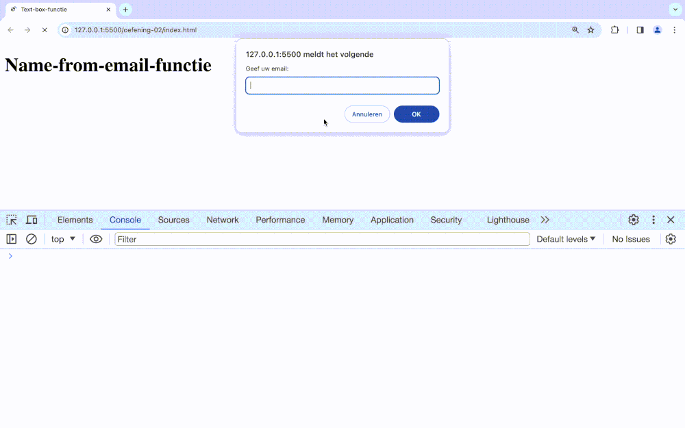
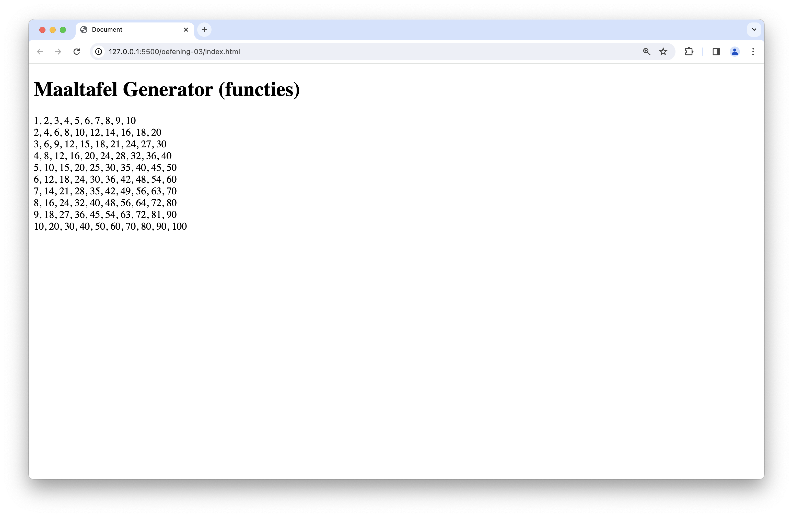
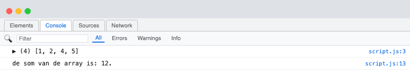

# Labo 15

Zorg dat je de volgende folderstructuur volgt:

```
webtechnologie/
├─ labo-01/
│  ├─ oefening-01/
│  │  ├─ index.html
│  │  ├─ images/
│  │  │  ├─ image-1.jpg 
│  │  │  └─ image-n.jpg 
│  │  ├─ css/
│  │  │   ├─ reset.css
│  │  │   └─ style.css
│  │  ├─ data/
│  │  │   ├─ datafile-1.json
│  │  │   └─ datafile-2.json
│  │  └─ js/
│  │     └─ script.js
│  ├─ oefening-02/
│  └─ oefening-n/
├─ labo-02/
└─ labo-n/      
```

- Gebruik steeds JS modules om globale variabelen te vermijden (`<script type="module" src="./path/to/script.js"></script>`)
- Volg de [Coding Guidelines](https://apwt.gitbook.io/webtechnologie/coding-guidelines)

## Oefeningen functies

### oefening 1: opwarmers
Schrijf de volgende functies om aan te tonen dat je alle concepten onder de knie hebt:

* Schrijf een functie zonder argumenten die een getal teruggeeft.
* Schrijf een functie zonder argumenten die een string teruggeeft.
* Schrijf een functie zonder argumenten die een boolean teruggeeft.
* Schrijf een functie zonder argumenten die een string afprint in de console.
* Schrijf een functie met twee argumenten (twee getallen) die een getal op het scherm afprint. Het getal dat wordt getoond moet iets doen met deze twee getallen.

### oefening 2: text-box-functie

#### leerdoelen

* input lezen
* schrijven van eigen functies

#### functionele analyse

Je programma toont een stuk tekst in je console in een tekstvak

#### technische analyse

Je kan de code om een box te tekenen hergebruiken uit een eerdere oefening. Je moet ze wel nog omzetten naar een functie.

Je maakt een functie `printTextBox` met een string als parameter. De functie toont de tekst in het tekstvak.

Je roept de functie een aantal keer aan met verschillende parameters.

#### voorbeeldinteractie


### oefening 3: name-from-email-functie

#### leerdoelen

* input lezen
* lussen
* schrijven van eigen functies

#### functionele analyse

Het programma toont het gedeelte van de e-mailadres dat de naam voorstelt.

#### technische analyse

Je kan de code van hergebruiken uit een eerdere oefening. Je moet ze opnieuw nog omzetten naar een functie.

Je maakt een functie `nameFromEmail` met 1 parameter die een email adres bevat. Deze functie geeft de voor en de achternaam terug in hoofdletters.

Je vraagt de gebruiker op een interactieve manier achter zijn email adres.

Je blijft een email adres vragen totdat deze een lege string ingeeft.

#### voorbeeldinteractie



### oefening 4: maaltafel-functie

#### leerdoelen

* gebruiken van lussen
* schrijven van eigen functies

#### functionele analyse

Je programma print de maaltafels van 1 tot en met 10 af (met 10 iteraties)

#### technische analyse

Je kan code van een eerdere oefening herbruiken.

Je maakt een functie `printMaaltafel` met 2 parameters: getal en iteraties. Deze functie print de maaltafel af van het gegeven getal en iteraties. De functie geeft niets terug en print enkel deze maaltafel af.

Zorg ervoor dat je voor de getallen 1 tot en met 10 de maaltafel afprint.

Je kan de getallen mooi oplijnen aan de hand van het  karakter. Zorg voor een 3de optionele parameter `separator` waarmee je de separator mee kan geven. Zorg voor een default  waarde voor deze separator als deze niet opgegeven wordt

#### voorbeeldinteractie



### oefening 5: schrikkeljaar-functie

#### leerdoelen

* gebruiken van lussen
* schrijven van eigen functies

#### functionele analyse

Je programma toont een overzicht van alle schrikkeljaren tussen 1950 en het huidige jaartal.

#### technische analyse

Je kan code herbruiken uit een eerdere oefening.

Je maakt een functie `isLeapYear` die 1 parameter aanvaardt met het jaartal en de functie geeft true terug als het een schrikkeljaar is en false als het geen schrikkeljaar is. Reminder: een schrikkeljaar is elk veelvoud van 400, alsook elk ander getal dat een veelvoud is van 4 maar niet van 100.

Je gebruikt een lus om voor de jaartallen tussen 1950 en dit jaar te berekenen of het een schrikkeljaar is of niet. Je print het jaar af als het een schrikkeljaar is.

Je kan het huidige jaar verkrijgen met de volgende code

```js
new Date().getFullYear();
```

#### voorbeeldinteractie


### oefening 6: array-sum

#### leerdoelen

* gebruiken van lussen
* schrijven van eigen functies
* arrays

#### functionele analyse

Je programma berekent de som van een array

#### technische analyse

Je maakt een functie `sum` die een array inneemt als parameter.

Print in deze functie eerst de array af met `console.log`;

Deze functie zal een `for` lus bevatten die de som berekent van de getallen in de array.

Deze functie geeft de som van de getallen in de array terug.

#### voorbeeldinteractie



### oefening 7: omrekenen van graden

#### leerdoelen

* schrijven van eigen functies
* rekenkundige operaties

#### functionele analyse

Schrijf een programma dat temperaturen kan omrekenen tussen Celsius en Fahrenheit.

#### technische analyse

- Vraag de gebruiker om een temperatuur en een eenheid (C of F).
- Gebruik een functie die:
    - Celsius omzet naar Fahrenheit met de formule: (C × 9/5) + 32
    - Fahrenheit omzet naar Celsius met de formule: (F - 32) × 5/9
- Toon de omgezette waarde in de console.
- Geef een foutmelding als de eenheid niet correct is ingevoerd.

## Spread operator

### oefening 8: gebruik van de spread operator

#### leerdoelen

* begrijpen hoe de spread-operator werkt.
* kunnen toepassen van de spread-operator om arrays samen te voegen en te kopiëren.

#### functionele analyse

Schrijf een JavaScript-functie genaamd `mergeArrays` die twee arrays accepteert en een nieuwe array retourneert waarin de elementen van beide arrays zijn samengevoegd. Gebruik de spread-operator om de arrays samen te voegen.

#### technische analyse

1. Schrijf een functie genaamd `mergeArrays` die twee parameters (arrays) accepteert.
2. Gebruik de spread-operator om beide arrays samen te voegen in een nieuwe array.
3. Lees het resultaat uit in de console.

#### voorbeeldinteractie


